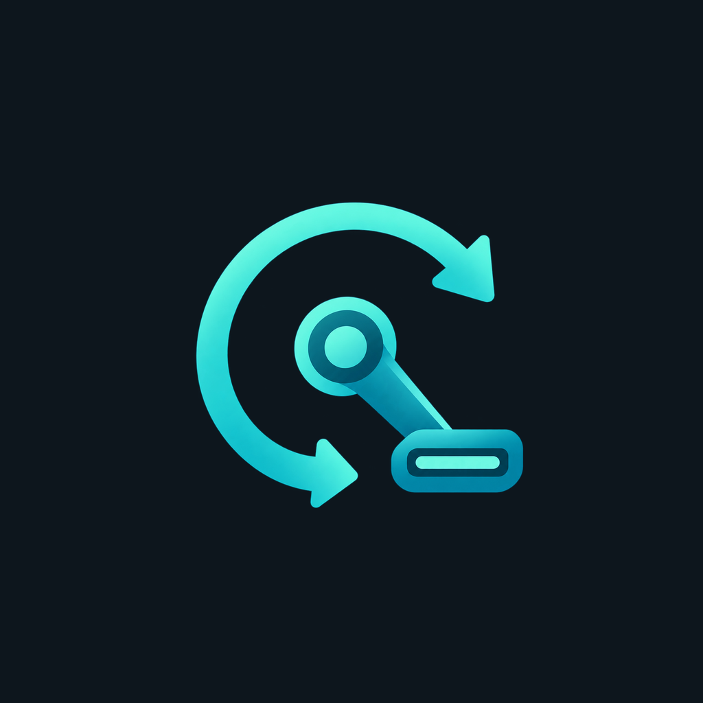
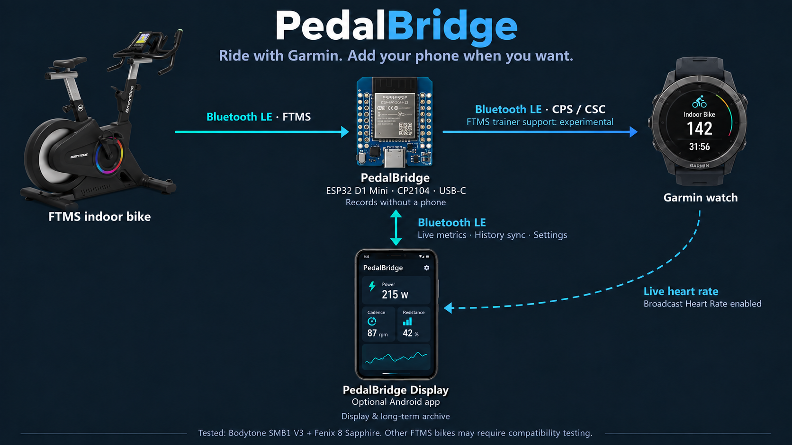

# PedalBridge

PedalBridge connects compatible Bluetooth FTMS indoor bikes to a Garmin watch through an ESP32, with an optional Android display. Recording a workout does not require your phone. The Bodytone SMB1 V3 is the currently tested bike.

- **PedalBridge 0.15.0**: ESP32 firmware in [`firmware/`](firmware).
- **PedalBridge Display 0.10.0**: Android companion app in [`android/`](android).

The app displays power, cadence, speed, distance, calories, resistance and optional live heart rate. Training, History and Settings tabs support dark/light themes, landscape orientation and swipe navigation. The progress chart uses dates, pinch zoom and panning.

The bridge records independently. Workout summaries stay on the ESP; per-second recordings are released after a verified transfer to the phone archive. When space runs low, the oldest completed recordings are removed first. The app keeps synchronized workouts locally and combines MyBodytone imports with recorded workouts in one timeline.

## Language

Both interfaces support **English and German**. English is the default. In the app, use **Settings → Appearance → Language**. On the ESP setup page, use the **Language** selector. Each preference is saved independently. Changing language does not restart Bluetooth connections or modify stored training data. Dates and numeric formatting follow the app language; original imported values remain unchanged.

## Installation

See [setup and builds](docs/SETUP.md), [Bluetooth protocol](docs/PROTOCOL.md), [storage and privacy](docs/DATA.md), and [changelog](docs/CHANGELOG.md). Download the APK and firmware from [Releases](https://github.com/wischm0b/PedalBridge/releases).

Android 12 or later is required. The firmware targets a classic ESP32 D1 Mini with CP2104 and USB-C. Package ID `de.smb1display`, archive identities and BLE UUIDs stay compatible with existing installations. The app also recognizes the older sensor names `SMB1 Bridge` and `SMB1 Trainer`.

## Bike compatibility

PedalBridge is designed around the standard [Bluetooth Fitness Machine Service (FTMS)](https://www.bluetooth.com/specifications/specs/fitness-machine-service-1-0-1/), rather than a Bodytone-only protocol. The firmware can discover FTMS devices or connect to a bike selected on the ESP setup page; `SMB1` is a fallback name filter, not an exclusive requirement.

A compatible bike must expose FTMS service `0x1826` and provide notifications on **Indoor Bike Data** (`0x2AD2`). Available metrics depend on the fields the bike transmits. The bridge also attempts **Request Control** and **Start/Resume** when the FTMS Control Point is available. Bikes with proprietary activation, pairing requirements or different FTMS behavior may need adjustments.

**Tested hardware:** Bodytone SMB1 V3 with a Garmin Fenix 8 Sapphire. Other FTMS bikes are candidates for compatibility testing; support for every FTMS bike is not guaranteed. When switching bikes, select the new device on the setup page to replace the saved bike selection.

## Limitations

Power transmission works with the Fenix 8 Sapphire. Garmin speed, distance and Smart Trainer discovery remain experimental. Bike power values are forwarded; the bridge is not a calibrated power meter. When bike energy readings are unavailable, calories are estimated from power assuming 24% efficiency; Garmin may calculate a different estimate. Live heart rate requires **Broadcast Heart Rate** on the watch and selecting its sensor in the app. Heart rate is currently live only and is not saved in the workout archive.

Licensed under GPL-3.0; see [LICENSE](LICENSE) and [third-party notices](THIRD_PARTY.md). This project is independent of Garmin and Bodytone.
